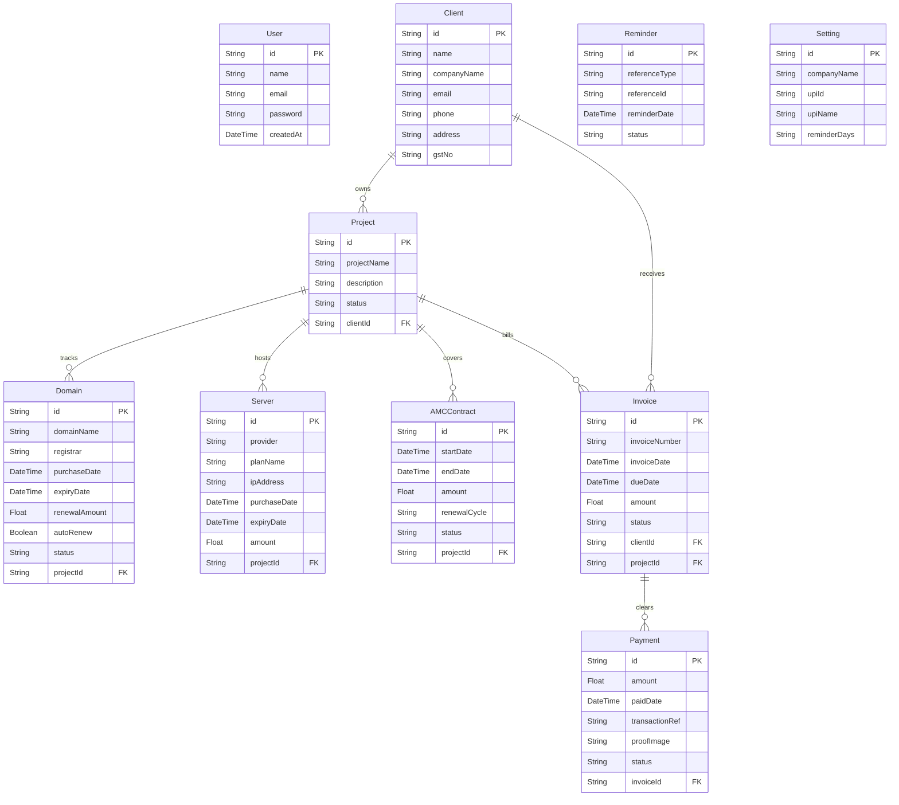

# 🚀 RenewalFlow - Client & Contract Renewals Manager

**RenewalFlow** is a comprehensive, production-ready SaaS platform built to track clients, projects, hosting servers, domains, AMC (Annual Maintenance Contracts), invoices, payments, and system settings in a single, high-fidelity dashboard. It features an automated email notification system, dynamic QR code invoice generating systems, and a modern glassmorphic UI.

This project is fully optimized for **Next.js 15**, **Tailwind CSS v4**, and cloud serverless deployments (using **Vercel** and **Neon PostgreSQL**).

---

## 🌟 Key Features

*   **🛡️ Custom Session Authentication**: Secure session-cookie authentication utilizing cryptographically secure SHA-256 hashing. Protected page routing implemented via Next.js Middleware.
*   **📊 Overview KPI Dashboard**: Real-time financial calculations (Active Clients, Monthly Revenue, Unpaid Invoices, Active Servers/Domains) with custom SVG monthly revenue charts.
*   **📂 Comprehensive Management Directory**:
    *   **Clients**: Log customer details, contact channels, and view active contracts.
    *   **Projects**: Track milestones, client associations, and related assets.
    *   **Domains**: Monitor registry endpoints with relative warning tags (green for active, orange for <30 days, red for <7 days, dark red for expired).
    *   **Servers**: Track costs, provider types, and IP addresses.
    *   **AMC Contracts**: Annual Maintenance Contracts with custom recurrence cycles (Monthly, Quarterly, Yearly).
*   **🧾 Invoice Builder with UPI QR Codes**: Easily generate professional invoices, view and print beautifully formatted sheets, and scan dynamic base64-generated UPI QR codes for payments.
*   **💳 Payment Submission & Audit Trail**: Client portal to upload payment screenshots and reference numbers, coupled with an admin verification portal (Approve/Reject actions).
*   **📈 Consolidated Financial Reports**: Date-range filtering, itemized sums, client-side CSV exports, and print-to-PDF layout rules.
*   **⚙️ Settings Panel**: Configure company details, UPI address parameters, and automated reminder day schedules.
*   **⏰ Automated Cron Engine**: Daily cron API endpoint (`/api/cron`) that scans for upcoming expirations, records notification history, and fires email alerts.

---

## 💻 Tech Stack

| Layer | Technology | Rationale |
| :--- | :--- | :--- |
| **Framework** | **Next.js 15 (App Router)** | Combines Server-Side Rendering (SSR) for optimal SEO and client-side interactivity. Server Actions simplify API calls without boilerplate REST/GraphQL routes. |
| **Styling** | **Tailwind CSS v4** | Clean styling, premium dark/glassmorphic design themes, responsive grids, and standard micro-animations. |
| **Database ORM** | **Prisma ORM** | Type-safe client, robust relational query builder, and automatic database schema migration. |
| **Database** | **PostgreSQL** | Relational cloud database suitable for transactional and financial structures. |
| **Authentication** | **Custom Cookie Session** | Custom secure HTTP-Only cookie system designed to bypass NextAuth configuration overhead. |
| **Icons** | **Lucide React** | Sleek and consistent outline icons. |

---

## ☁️ Deployment Stack & Infrastructure

The application's deployment architecture is fully serverless and cloud-native, prioritizing high availability, automatic scaling, and frictionless developer operations (DevOps).

*   **Frontend & API Hosting (Vercel)**:
    *   The entire Next.js application is deployed to **Vercel**, which natively supports Next.js 15 features including dynamic Server Components, optimized asset loading, and global edge routing.
    *   Leverages Git-integrated CI/CD. Every push to the `main` branch triggers an automated build and zero-downtime deployment.
*   **Database Cloud Host (Neon PostgreSQL)**:
    *   Utilizes **Neon**, a serverless, cloud-native PostgreSQL database engine.
    *   Features dynamic compute scaling, automatically scaling resources up during traffic peaks and down to zero when idle to conserve compute resources.
    *   Uses pgBouncer-powered connection pooling, allowing thousands of simultaneous database queries from edge servers without exhausting database connection limits.
*   **DevOps & Build Pipelines**:
    *   Vercel build tasks run schema synchronizations dynamically via Prisma CLI, ensuring the database state always aligns with the repository models.

---

## 📊 Database Schema Relationships

