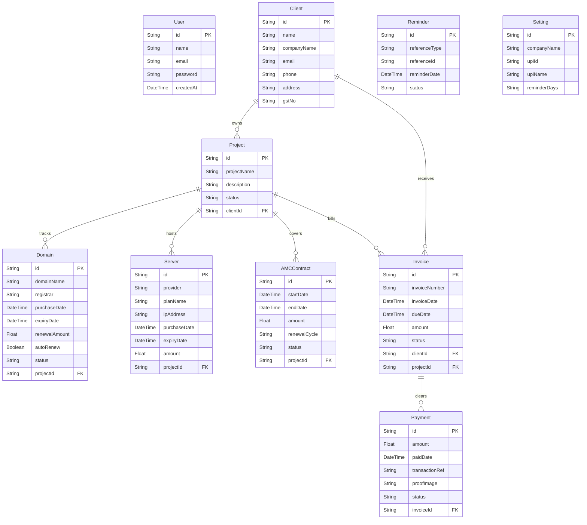

# 🚀 RenewalFlow - Client & Contract Renewals Manager

**RenewalFlow** is a comprehensive, production-ready SaaS platform built to track clients, projects, hosting servers, domains, AMC (Annual Maintenance Contracts), invoices, payments, and system settings in a single, high-fidelity dashboard. It features an automated email notification system, dynamic QR code invoice generating systems, and a modern glassmorphic UI.

This project is fully optimized for **Next.js 15**, **Tailwind CSS v4**, and cloud serverless deployments (using **Vercel** and **Neon PostgreSQL**).

---

## 🌟 Key Features

*   **🛡️ Custom Session Authentication**: Secure session-cookie authentication utilizing cryptographically secure SHA-256 hashing. Protected page routing implemented via Next.js Middleware.
*   **📊 Overview KPI Dashboard**: Real-time financial calculations (Active Clients, Monthly Revenue, Unpaid Invoices, Active Servers/Domains) with custom SVG monthly revenue charts.
*   **📂 Comprehensive Management Directory**:
    *   **Clients**: Log customer details, contact channels, and view active contracts.
    *   **Projects**: Track milestones, client associations, and related assets.
    *   **Domains**: Monitor registry endpoints with relative warning tags (green for active, orange for <30 days, red for <7 days, dark red for expired).
    *   **Servers**: Track costs, provider types, and IP addresses.
    *   **AMC Contracts**: Annual Maintenance Contracts with custom recurrence cycles (Monthly, Quarterly, Yearly).
*   **🧾 Invoice Builder with UPI QR Codes**: Easily generate professional invoices, view and print beautifully formatted sheets, and scan dynamic base64-generated UPI QR codes for payments.
*   **💳 Payment Submission & Audit Trail**: Client portal to upload payment screenshots and reference numbers, coupled with an admin verification portal (Approve/Reject actions).
*   **📈 Consolidated Financial Reports**: Date-range filtering, itemized sums, client-side CSV exports, and print-to-PDF layout rules.
*   **⚙️ Settings Panel**: Configure company details, UPI address parameters, and automated reminder day schedules.
*   **⏰ Automated Cron Engine**: Daily cron API endpoint (`/api/cron`) that scans for upcoming expirations, records notification history, and fires email alerts.

---

## 💻 Tech Stack

| Layer | Technology | Rationale |
| :--- | :--- | :--- |
| **Framework** | **Next.js 15 (App Router)** | Combines Server-Side Rendering (SSR) for optimal SEO and client-side interactivity. Server Actions simplify API calls without boilerplate REST/GraphQL routes. |
| **Styling** | **Tailwind CSS v4** | Clean styling, premium dark/glassmorphic design themes, responsive grids, and standard micro-animations. |
| **Database ORM** | **Prisma ORM** | Type-safe client, robust relational query builder, and automatic database schema migration. |
| **Database** | **PostgreSQL** | Relational cloud database suitable for transactional and financial structures. |
| **Authentication** | **Custom Cookie Session** | Custom secure HTTP-Only cookie system designed to bypass NextAuth configuration overhead. |
| **Icons** | **Lucide React** | Sleek and consistent outline icons. |

---

## ☁️ Deployment Stack

*   **Frontend / Hosting**: **Vercel** (with continuous deployment directly from your GitHub repository).
*   **Database Cloud Host**: **Neon Serverless Postgres** (scales automatically to 0 when inactive to maintain the free tier, with support for connection pooling).
*   **CI/CD Pipeline**: Integrated GitHub actions and Vercel build triggers running Prisma schema synchronizations.

---

## 📊 Database Schema Relationships



---

## ⚙️ Cloud Deployment Steps

### 1. Database Provisioning (Neon)
1. Go to [Neon.tech](https://neon.tech/) and create a free PostgreSQL database.
2. Under your dashboard, copy the connection strings:
   * **Pooled Connection string** (typically includes `-pooler` in the host).
   * **Direct Connection string** (unpooled).

### 2. Vercel Project Setup
1. Log in to [Vercel](https://vercel.com/) with GitHub.
2. Select **Add New** > **Project** and import your repository.
3. Under **Settings** > **Environment Variables**, add the database connection variables:
   * **`POSTGRES_PRISMA_URL`**: `postgresql://neondb_owner:...-pooler...`
   * **`POSTGRES_URL_NON_POOLING`**: `postgresql://neondb_owner:...`
4. Set the **Build Command** under *Build & Development Settings* to:
   ```bash
   npx prisma db push && next build
   ```
5. Click **Deploy**. Vercel will build the frontend and automatically sync the Prisma schemas to your database.

### 3. Seed Initial Database (Local Terminal)
Since you need the initial administrator account (`admin@renewalflow.com`) created, run the seeder script from your local machine targeting the Neon database:
1. Make sure your local `.env` contains the same `POSTGRES_PRISMA_URL` and `POSTGRES_URL_NON_POOLING` values.
2. Run:
   ```bash
   npx prisma db push
   npx tsx prisma/seed.ts
   ```

You are now ready to log in on Vercel with your credentials!
